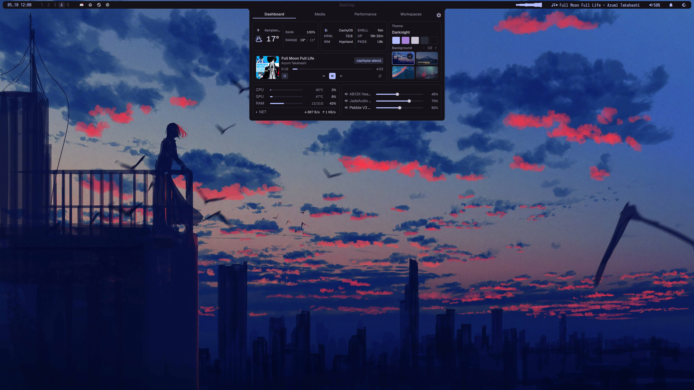

# darknight-qs

A Quickshell bar and desktop shell for a Hyprland desktop. It
replaces waybar with one unified slab: workspaces, tray, media and audio, CPU, a
dashboard, quick panels, notifications, and a power menu.

Please note that this project was mostly vibecoded.



This is personal-use software. Some modules assume my hardware and habits, so
read the [monitor](#monitors) and [notification](#notifications) notes before you
rely on it. MIT licensed, see [LICENSE](LICENSE); third-party notices and the
Omarchy trademark disclaimer are in [NOTICE](NOTICE).

## Requirements

### Required

| Tool | Why it is needed |
| --- | --- |
| [Quickshell](https://quickshell.org) 0.3.1 or newer | the shell runtime |
| [Hyprland](https://hyprland.org) | the Wayland compositor; workspaces, focus, and window title come from Hyprland IPC |
| [PipeWire](https://pipewire.org) | audio devices and volume |
| [`cava`](https://github.com/karlstav/cava) | the audio visualizer |
| `curl` | weather and calendar fetches |
| `python3` | the calendar, Spotify, and clock helper scripts |

### Optional

| Tool | Adds |
| --- | --- |
| `playerctl` | MPRIS media controls; playback pauses on suspend |
| `mpc` | MPD control; playback pauses on suspend |
| `gcalcli` | the opt-in multi-calendar backend (see [Calendar setup](docs/user/calendar.md)) |
| `awww` | applies theme backgrounds |
| [`kitty`](https://sw.kovidgoyal.net/kitty/) | the default terminal for terminal apps and the launcher's Run row |
| one of `hyprlock`, `betterlockscreen`, `i3lock` | the power menu's Lock action |

Every optional tool degrades one feature when absent; the shell still starts.

## Install and run

### Prerequisites (Arch and CachyOS)

Install the required packages, then the optional ones you want:

```sh
# official repos
sudo pacman -S quickshell hyprland pipewire wireplumber cava curl python \
  otf-geist-mono-nerd ttc-iosevka

# optional, official
sudo pacman -S playerctl mpc awww hyprlock i3lock

# AUR: Geist UI font, gcalcli
paru -S otf-geist gcalcli
```

The AUR line assumes `paru`; substitute your AUR helper. `ttc-iosevka` is the
official Iosevka package, and `wireplumber` provides `wpctl`, which the audio
module calls to change the default sink.

Clone anywhere and run the checkout by path:

```sh
git clone https://github.com/chickenr1ce/darknight-qs ~/src/darknight-qs
~/src/darknight-qs/scripts/install.sh
quickshell -p ~/src/darknight-qs
```

`scripts/install.sh` reports the required and optional tools, the three font
families the shell names, and whether another daemon holds the notification bus.
It then symlinks `scripts/qs-theme.sh` to `~/.local/bin/qs-theme`, seeds the
bundled `darknight` theme (palette plus two backgrounds) into
`~/.local/share/quickshell/themes`, and offers to link the clone into
`~/.config/quickshell` so plain `quickshell` loads it:

```sh
~/src/darknight-qs/scripts/install.sh --link
quickshell
```

`quickshell -p <dir>` works from any clone path; the link is only a shortcut.

`install.sh` also runs `scripts/wire-themed-apps.sh --check`, which reports what
the themed apps (Hyprland, kitty, hyprlock, btop, Firefox, Vencord, Spicetify)
still need wired, and offers to apply it: `--wire-apps` applies without asking,
`--no-wire-apps` reports only, and the default asks on a terminal. Applying
backs each edited file up first; see
[Theme desktop setup](docs/user/theme-desktop-setup.md).

Add autostart to your own Hyprland config. The installer prints this line and
never edits your config:

```
exec-once = quickshell -p /home/<you>/src/darknight-qs
```

Once the clone is linked into `~/.config/quickshell`, `exec-once = quickshell`
is enough.

### Fonts

The shell names three families: Iosevka (bar text), Geist (reading surfaces),
and GeistMono Nerd Font (icons). Without Iosevka or Geist the text falls back
to a default face, but the icons still work because they use GeistMono Nerd
Font. Without **GeistMono Nerd Font**, `config/Icons.qml` renders boxes instead
of glyphs. `scripts/install.sh` warns about a missing family and names the
package for it.

### Monitors

The bar is built for a two-monitor layout. The primary monitor shows the full
bar; every other screen shows the minimal bar (clock and workspaces). By default
the primary is the first connected screen by position (x, then y, then name).
Pick another under Settings → Monitors, or choose Auto to return to the
positional default; the choice persists.

The workspace split is still fixed: the second monitor's workspaces are 6–10
(`modules/Workspaces.qml`).

### Notifications

The shell claims `org.freedesktop.Notifications` at startup. Stop `mako` or
`dunst` and disable its autostart first, or the shell cannot own the bus. The
installer warns when one holds it.

### App launcher

The dashboard's Apps tab is the launcher: Pinned and Recent sections, a ranked
search over installed apps, and inline Focus, Kill, and Pin on a running app.
Point your Super key at the `dashboard apps` IPC target to open it from
anywhere; the [app launcher guide](docs/user/app-launcher.md) covers the
keybind, the keys and mouse, the context menu, and hiding and unhiding apps.

### Polkit

The shell registers its own polkit authentication agent, so privileged prompts
are the shell's dialog and no external agent is needed. Stop and disable the
other agents so the shell is the only one registered. The
[polkit setup](docs/user/polkit.md) page covers that, the keys the dialog takes,
and troubleshooting.

### Themes

On a fresh install with no saved selection, the shell starts on the bundled
`darknight` theme. `install.sh` seeds it into
`~/.local/share/quickshell/themes`, so the Settings → Theme picker and the
dashboard Theme block list it with two backgrounds on first run. Switch themes,
add backgrounds, or install omarchy v4 themes from a git URL with
[qs-theme](docs/user/qs-theme.md); the seeded palette also retints Hyprland,
kitty, hyprlock, starship, yazi, and btop when those targets are wired up
([desktop setup](docs/user/theme-desktop-setup.md)).

## Updating

Updates are a `git pull` in the clone, on the `main` branch:

```sh
cd ~/src/darknight-qs
git pull --ff-only
```

Quickshell watches its config files and reloads when their content changes, so
a pull reloads the bar on its own. A restart is still the reliable step after a
structural change: a new file, a `qmldir`, or an import. Settings live in XDG
state and cache (`~/.local/state/quickshell`, `~/.cache/quickshell`), not the
repo, so they survive an update.

`scripts/update.sh` runs the whole step. It refuses a dirty tree, pulls `main`
fast-forward only, re-checks dependencies, and restarts the shell on this clone:

```sh
~/src/darknight-qs/scripts/update.sh
```

## Optional integrations

Each of these is optional; the shell runs without it.

- [Calendar setup](docs/user/calendar.md) (optional) — the calendar panel reads
  Google Calendar secret iCal URLs; write the URL file once, and add `gcalcli`
  for the birthdays calendar and per-calendar toggles.
- [Weather and city search](docs/user/weather.md) (optional) — the dashboard
  weather block works with `curl` and no API key; the doc covers the cache and
  location search.
- [Spotify Connect](docs/user/spotify-connect.md) (optional) — the dashboard
  player block needs a one-time Spotify app authorization.
- [Theme desktop setup](docs/user/theme-desktop-setup.md) (optional) — retint
  Hyprland, kitty, hyprlock, starship, yazi, and btop from the active theme.
- [qs-theme](docs/user/qs-theme.md) (optional) — install and switch omarchy v4
  themes, and manage backgrounds, from the CLI.
- [Power menu keybind](docs/user/power-menu.md) (optional) — open the power
  menu from a Hyprland keybind through the shell's `power` IPC target. The
  [IPC targets](docs/user/ipc.md) page covers that target and the rest
  (calendar, notifications, dashboard, DND, and volume).

## Trademarks and third-party notices

Omarchy is a trademark of its owner (see https://omarchy.org/brand/).
darknight-qs is an independent community project: it is not affiliated with
or endorsed by the Omarchy project or 37signals.

`services/ThemeParsers.js` ports the color cascade from Omarchy's
`bin/omarchy-theme-color`; Omarchy is MIT licensed and its notice is kept in
[NOTICE](NOTICE). Imported themes are third-party content with their own
licenses, downloaded by the user and not redistributed by this repository.

The two background images bundled with the `darknight` theme are third-party
artwork, credited to their authors in [NOTICE](NOTICE), not covered by this
repository's MIT license, and included with all rights remaining with the
artists.
