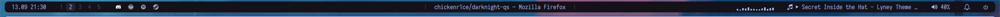

# darknight-qs

A Quickshell bar and desktop shell for a Hyprland desktop. It
replaces waybar with one unified slab: workspaces, tray, media and audio, CPU, a
dashboard, quick panels, notifications, and a power menu.



This is personal-use software. Some modules assume my hardware and habits, so
read the [monitor](#monitors) and [notification](#notifications) notes before you
rely on it. MIT licensed, see [LICENSE](LICENSE).

## Requirements

### Required

| Tool | Why it is needed |
| --- | --- |
| [Quickshell](https://quickshell.org) 0.3.1 or newer | the shell runtime |
| [Hyprland](https://hyprland.org) | the Wayland compositor; workspaces, focus, and window title come from Hyprland IPC |
| [PipeWire](https://pipewire.org) | audio devices and volume |
| [`cava`](https://github.com/karlstav/cava) | the audio visualizer |
| `curl` | weather and calendar fetches |
| `python3` | the calendar, Spotify, and clock helper scripts |

### Optional

| Tool | Adds |
| --- | --- |
| `playerctl` | MPRIS media controls; playback pauses on suspend |
| `mpc` | MPD control; playback pauses on suspend |
| `gcalcli` | the opt-in multi-calendar backend (see [Calendar](#calendar-optional)) |
| `awww` | applies theme backgrounds |
| one of `hyprlock`, `betterlockscreen`, `i3lock` | the power menu's Lock action |

Every optional tool degrades one feature when absent; the shell still starts.

## Install and run

### Prerequisites (Arch and CachyOS)

Install the required packages, then the optional ones you want:

```sh
# official repos
sudo pacman -S quickshell hyprland pipewire wireplumber cava curl python \
  otf-geist-mono-nerd ttc-iosevka

# optional, official
sudo pacman -S playerctl mpc awww hyprlock i3lock

# AUR: Geist UI font, gcalcli
paru -S otf-geist gcalcli
```

The AUR line assumes `paru`; substitute your AUR helper. `ttc-iosevka` is the
official Iosevka package, and `wireplumber` provides `wpctl`, which the audio
module calls to change the default sink.

Clone anywhere and run the checkout by path:

```sh
git clone https://github.com/chickenr1ce/darknight-qs ~/src/darknight-qs
~/src/darknight-qs/scripts/install.sh
quickshell -p ~/src/darknight-qs
```

`scripts/install.sh` reports the required and optional tools, the three font
families the shell names, and whether another daemon holds the notification bus.
It then symlinks `scripts/qs-theme.sh` to `~/.local/bin/qs-theme`, and offers to
link the clone into `~/.config/quickshell` so plain `quickshell` loads it:

```sh
~/src/darknight-qs/scripts/install.sh --link
quickshell
```

`quickshell -p <dir>` works from any clone path; the link is only a shortcut.

Add autostart to your own Hyprland config. The installer prints this line and
never edits your config:

```
exec-once = quickshell -p /home/<you>/src/darknight-qs
```

Once the clone is linked into `~/.config/quickshell`, `exec-once = quickshell`
is enough.

### Fonts

The shell names three families: Iosevka (bar text), Geist (reading surfaces),
and GeistMono Nerd Font (icons). Without Iosevka or Geist the text falls back
to a default face, but the icons still work because they use GeistMono Nerd
Font. Without **GeistMono Nerd Font**, `config/Icons.qml` renders boxes instead
of glyphs. `scripts/install.sh` warns about a missing family and names the
package for it.

### Monitors

The bar is built for a two-monitor layout. The primary monitor shows the full
bar; every other screen shows the minimal bar (clock and workspaces). By default
the primary is the first connected screen by position (x, then y, then name).
Pick another under Settings → Monitors, or choose Auto to return to the
positional default; the choice persists.

The workspace split is still fixed: the second monitor's workspaces are 6–10
(`modules/Workspaces.qml`).

### Notifications

The shell claims `org.freedesktop.Notifications` at startup. Stop `mako` or
`dunst` and disable its autostart first, or the shell cannot own the bus. The
installer warns when one holds it.

## Updating

Updates are a `git pull` in the clone, on the `main` branch:

```sh
cd ~/src/darknight-qs
git pull --ff-only
```

Quickshell watches its config files and reloads when their content changes, so
a pull reloads the bar on its own. A restart is still the reliable step after a
structural change: a new file, a `qmldir`, or an import. Settings live in XDG
state and cache (`~/.local/state/quickshell`, `~/.cache/quickshell`), not the
repo, so they survive an update.

`scripts/update.sh` runs the whole step. It refuses a dirty tree, pulls `main`
fast-forward only, re-checks dependencies, and restarts the shell on this clone:

```sh
~/src/darknight-qs/scripts/update.sh
```

## Calendar (optional)

The calendar panel reads Google Calendar secret iCal URLs. There is no settings
field for them yet, so write the URL file once. One URL per non-blank line; a
single URL also works:

```sh
mkdir -p "${XDG_STATE_HOME:-~/.local/state}/quickshell"
printf '%s\n' '<primary-url>' '<holidays-url>' > "${XDG_STATE_HOME:-~/.local/state}/quickshell/calendar-url"
chmod 600 "${XDG_STATE_HOME:-~/.local/state}/quickshell/calendar-url"
```

Get each URL from Google Calendar on the web: Settings for my calendars →
Integrate calendar → "Secret address in iCal format". Each URL is a bearer token:
keep the file owner-only and never commit it. The panel works offline from the
last good cache.

`bash` does not expand `~` inside `${...}`, so on bash substitute `$HOME` for
`~` in that path.

For the Contacts birthdays calendar, or per-calendar toggles, install `gcalcli`
and follow the Tier 2 steps in the `scripts/calendar-fetch.py` docstring.

## Optional integrations

Each of these is optional; the shell runs without it.

- [Weather and city search](docs/weather.md) (optional) — the dashboard weather
  block works with `curl` and no API key; the doc covers the cache and location
  search.
- [Spotify Connect](docs/spotify-connect.md) (optional) — the dashboard player
  block needs a one-time Spotify app authorization.
- [Theme desktop setup](docs/theme-desktop-setup.md) (optional) — retint
  Hyprland, kitty, hyprlock, and starship from the active theme.
- [qs-theme](docs/qs-theme.md) (optional) — install and switch omarchy v4
  themes, and manage backgrounds, from the CLI.
